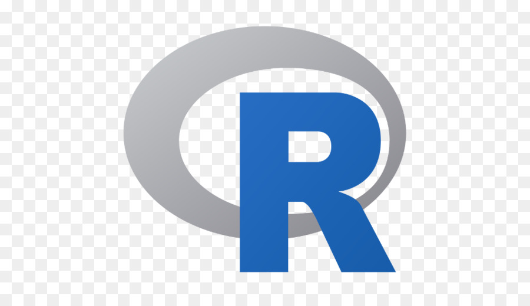

# 👋 Hi there, I am <a href="https://elmergustavo.github.io/">Francisco José Medina Villamizar!</a> 

 

<!-- <h1 style="font-size: 2.5rem; font-weight: bold; text-align: center;" align='center'>  Hello World! </h1>    -->

👦🏻 Francisco | 👨‍💻 Electronic Engineer | Colombia

 

<h2 style="display: flex; align-items: center; margin-bottom: 1rem;"> About Me</h2>

- 🤔 &nbsp; Exploring new technologies and developing software solutions and quick hacks.
- 🎓 &nbsp; I'm working in oil and gas industry.
- ✍️ &nbsp; passionate about drawing, literature, painting and taekwondo.

<!-- <h3> 🛠 &nbsp;Tech Stack</h3> -->

<code></code>
<code></code>
<code></code>
<code></code>

 

  
    
 <!--
  
   
  -- >

<!--
**fjmedinavilla28/fjmedinvilla28.github.io** is a ✨ _special_ ✨ repository because its `README.md` (this file) appears on your GitHub profile.

Here are some ideas to get you started:

- 🔭 I’m currently working on ... modific
- 🌱 I’m currently learning ...
- 👯 I’m looking to collaborate on ...
- 🤔 I’m looking for help with ...
- 💬 Ask me about ...
- 📫 How to reach me: ...
- 😄 Pronouns: ...
- ⚡ Fun fact: ...
-->
